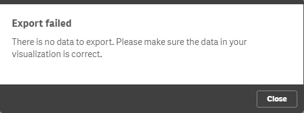
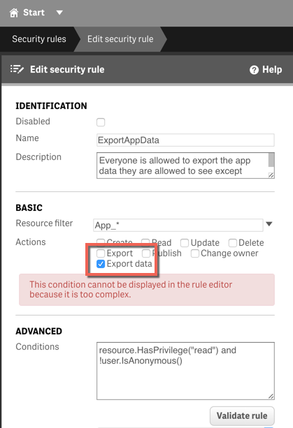

Qlik Sense 3.0 introduces the possibility to enable/disable the functionality to export the underlying data of a visualization extension.

To define whether exporting data should be enabled or not, use the property `exportData` in the section `support`:


```js

	definition: {
		...
	},
	support: {
		exportData: true
	},
	initialProperties: {
		...
	},
	...
			

```

The following context menu will then be shown:


## Conditional enablement of `exportData`

If the user wants to export the data, but the extension does not (yet) contain any data, the following notification will be shown:



To prevent such a message, `exportData` can also return a function instead of a boolean value:

```js

	support: {
		exportData: function( layout ) {
			// The context menu will only be enabled if there is data to export.
			return layout.qHyperCube.qDataPages[0].qMatrix.length;
		} 
	}

```

## Qlik Sense server & export (`exportData`)

Note that settings defined in your Qlik sense visualization extension can be overruled in Qlik Sense server's management console:


