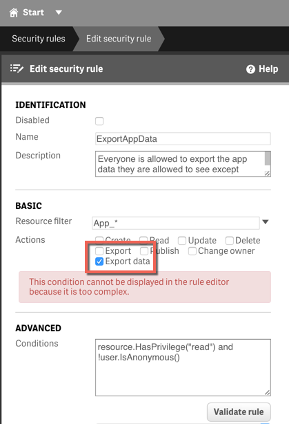

In Qlik Sense 3.0 support for printing extensions has been added. Therefore it is now possible to:

- Export a single extension as image (right click)
- Include visualization extensions in stories and print the story.
- Include visualization extensions if a PDF for the current sheet is created.

To enable this functionality the following changes need to be made to (existing) visualization extensions:

## Meta data

To tell Qlik Sense that your visualization extension should be enabled for printing, add the following properties:

```js
	
	definition: {
		...
	},
	support: {
		export: true
	},
	paint: function() {
		...
	},
	...

```

## Finished rendering notification

Then in the `paint` method the printing service needs to be informed that the extension has finished rendering:

```js
	
	// ...
	paint: function() {
		
		return qlik.Promise.resolve();
	}	 	 
	// ... 
	
```

So even in case your visualization extension is loading data from an external source and it takes some time that rendering is finished, this solution will take care of that:

```js
	paint: function() {
		
		whateverAsyncTask().then( function() {
			return qlik.Promise.resolve();
		});
		
	}
```

## Qlik Sense server & printing (`export`)

Note that settings defined in your Qlik sense visualization extension can be overruled in Qlik Sense server's management console:



